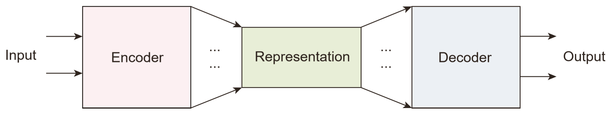
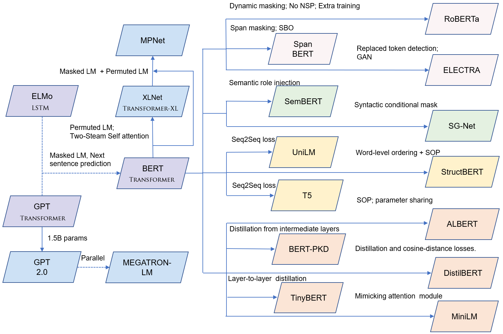

# AwesomeMRC

**update**
*The code for model ensemble (grid search): [run_ensemble_grid.py](transformer-mrc/run_ensemble_grid.py)*

*working in progress

This repo is our research summary and playground for MRC.  More features are coming.

## Requirements
The codes are based on [Transformers](https://github.com/huggingface/transformers) v2.3.0. The dependencies are the same.
You can install the dependencies by `pip install transformers==2.3.0` 

or directly download the requirements file: https://github.com/huggingface/transformers/blob/v2.3.0/requirements.txt and run `pip install -r requirements`.

## Summary

Looking for a comprehensive and comparative review of MRC? check out our new survey paper: **[Machine Reading Comprehension: The Role of Contextualized Language Models and Beyond](https://arxiv.org/abs/2005.06249)** (preprint, 2020).

In this work, MRC model is regarded as a two-stage Encoder-Decoder architecture. Our empirical analysis is shared in this repo. 



## Encoder:

1) Language Units

    [Subword-augmented Embedding for Cloze Reading Comprehension (COLING 2018)](https://www.aclweb.org/anthology/C18-1153/)
    
    [Effective Subword Segmentation for Text Comprehension (TASLP)](https://arxiv.org/abs/1811.02364)

2) Linguistic Knowledge

    [Semantics-aware BERT for language understanding (AAAI 2020)](https://arxiv.org/abs/1909.02209)
    
    [SG-Net: Syntax-Guided Machine Reading Comprehension (AAAI 2020)](https://arxiv.org/abs/1908.05147)
    
    [LIMIT-BERT: Linguistic Informed Multi-Task BERT (preprint)](https://arxiv.org/pdf/1910.14296.pdf)

3) Commonsense Injection

    [Multi-choice Dialogue-Based Reading Comprehension with Knowledge and Key Turns (preprint)](https://arxiv.org/abs/2004.13988)

4) Contextualized language models (CLMs) for MRC:



### Decoder:

The implementation is based on [Transformers](https://github.com/huggingface/transformers) v2.3.0. 

As part of the techniques in our Retro-Reader paper:

[Retrospective Reader for Machine Reading Comprehension (preprint)](https://arxiv.org/abs/2001.09694)

### Answer Verification

**1) Multitask-style verification**

   We evaluate different loss functions 
    
   *cross-entropy* (`run_squad_av.py`)
   
   *binary cross-entropy* (`run_squad_av_bce.py`)
    
   *mse regression*  (`run_squad_avreg.py`)

**2) External verification**

   Train an external verifier (`run_cls.py`)

### Matching Network

   *Cross Attention* (`run_squad_seq_trm.py`)
    
   *Matching Attention* (`run_squad_seq_sc.py`)

<u>Related Work</u>:

  [Modeling Multi-turn Conversation with Deep Utterance Aggregation (COLING 2018)](https://www.aclweb.org/anthology/C18-1317/)

  [DCMN+: Dual Co-Matching Network for Multi-choice Reading Comprehension (AAAI 2020)](https://arxiv.org/pdf/1908.11511.pdf)

### Answer Dependency

   Model answer dependency (start + seq -> end) (`run_squad_dep.py`)

### Example: Retrospective Reader

   1) train a sketchy reader (`sh_albert_cls.sh`)
    
   2) train an intensive reader (`sh_albert_av.sh`)
    
   3) rear verification: merge the prediction for final answer (`run_verifier.py`)
    
    SQuAD 2.0 Dev Results:	
    
      ```
      {
      "exact": 87.75372694348522, 
      "f1": 90.91630165754992, 
      "total": 11873, 
      "HasAns_exact": 83.1140350877193, 
      "HasAns_f1": 89.4482539777485, 
      "HasAns_total": 5928, 
      "NoAns_exact": 92.38015138772077, 
      "NoAns_f1": 92.38015138772077, 
      "NoAns_total": 5945
      }
      ```

### Question Classification
   [One-shot Learning for Question-Answering in Gaokao History Challenge (COLING 2018)](https://www.aclweb.org/anthology/C18-1038/)

### Citation

```
@article{zhang2020retrospective,
  title={Machine Reading Comprehension: The Role of Contextualized Language Models and Beyond},
  author={Zhang, Zhuosheng and Zhao, Hai and Wang, Rui},
  journal={arXiv preprint arXiv:2005.06249},
  year={2020}
}

@article{zhang2020retrospective,
  title={Retrospective reader for machine reading comprehension},
  author={Zhang, Zhuosheng and Yang, Junjie and Zhao, Hai},
  journal={arXiv preprint arXiv:2001.09694},
  year={2020}
}
```
## Related Records (best)

[CMRC 2017](https://hfl-rc.github.io/cmrc2017/leaderboard/): The **best** single model (2017).

[SQuAD 2.0](https://rajpurkar.github.io/SQuAD-explorer/): 
The **best** among all submissions (both single and ensemble settings);
The **first** to surpass human benchmark on both EM and F1 scores with a single model (2019).

[SNLI](https://nlp.stanford.edu/projects/snli/): The **best** among all submissions (2019-2020).

[RACE](http://www.qizhexie.com/data/RACE_leaderboard.html): The **best** among all submissions (2019).

[GLUE](https://gluebenchmark.com/): The **3rd best** among all submissions (early 2019).

## Contact

Feel free to email zhangzs [at] sjtu.edu.cn if you have any questions.

